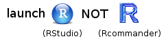
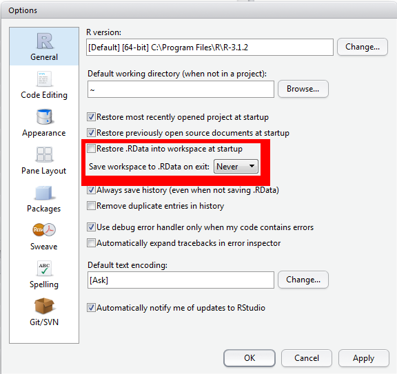

# What is `R`?<a id="orgacf96ab"></a>

<div class="org-center">
*A programming environment for data processing and statistical analysis*
</div>


-   free and open-source
-   community supported
-   continually evolving
-   promotes *reproducible research*

# Interacting with `R`<a id="org09a886d"></a>

## The Base R Console<a id="org47914e6"></a>

R is was developed almost two decades ago, and has a longer history as a derivative language of the scripting language S-PLUS developed in Bell Labs in the 70s and 80s.  &ldquo;Base R&rdquo; consists of a &ldquo;Read Evaluate Print Loop&rdquo; (REPL) command interpreter, in which you type in text commands, which are evaluated, and the results of which are printed to the screen.  This &ldquo;R Console&rdquo; window looks something like this.


## The RStudio Integrated Development Environment (IDE)<a id="org20547dc"></a>

However, when you are developing a script, you will want to work in a text editor and send commands to the console, rather than typing directly into the console.  Developing an analysis script is R is essentially an exercise in programming, and for developing code it is best to use an Integrated Development Environment or IDE.  An IDE provides additional functionality that wraps around the basic console.  


The IDE that is highly recommended for this class is by RStudio (<http://www.rstudio.com>) and is depicted above.  This IDE provides multiple windows in additional to the console that greatly facilitate developing code.  In addition to the console (appearing as the bottom left window in the above figure), there is a script editor (top left), which provides syntax highlighting, autocompletion, and pop-up tool tips, a window showing functions and objects residing in memory for the session in the &ldquo;Environment&rdquo; tab (top right window in the figure), and a window that shows plots, files in the working directory, available add-on packages, and documentation (bottom right).

You will install both base R and RStudio, but will interact with R through the RStudio IDE.  You will have icons for both RStudio and for a very primitive IDE called &ldquo;R commander&rdquo; which comes packaged with R.  R commander is not as sophisticated or user-friendly as RStudio, so make sure you launch the RStudio IDE and not R commander by clicking on the correct icon.  Launch RStudio will also launch the R console, so that is all you need to click.

ALWAYS REMEMBER: Launch R though the RStudio IDE:



If you are an experienced programmer, you might want to consider using Emacs + ESS + Org Mode as an IDE instead of RStudio.  (In fact, the document you are currently reading was written in emacs using org-mode markdown and exported to HTML).  See [this link](http://orgmode.org/worg/org-contrib/babel/how-to-use-Org-Babel-for-R.html) if you want to go this advanced route.

# Installing `R`<a id="org125726f"></a>

It is recommended that you at least attempt to install R and RStudio on your own workstation.  In the long run, it will be better to have it on your own system, and moreover, it won&rsquo;t cost you anything.  However, you don&rsquo;t have to be that ambitious.  There are workstations in the Boyd Orr labs that have R/RStudio installed; additionally, library workstations may also have copies installed. The upside of using these workstations is that everything has been installed and tested.  The downside (apart from the obvious of not being able to take them home with you) is that you will have limited ability to configure it to your needs because you lack access privileges.  There may be some packages that won&rsquo;t install, and those that do install successfully will be wiped away after you logout.  These annoyances can be avoided by having your own version.

Installing R and RStudio is very easy.  The sections below explain how, but in case you find it confusing, [there is a helpful YouTube video here](https://www.youtube.com/watch?v=lVKMsaWju8w).

## Installing Base R<a id="org33c4b11"></a>

Install base R from one of the mirrors near you.  They are listed at
<http://cran.r-project.org/mirrors.html>.  If a particular mirror is
down, try another one.  Once you have chosen a mirror, choose the
download link for your operating system (Linux, Mac OS X, or Windows)
and install &rsquo;base&rsquo; binaries for distribution.  If you are using Linux
or Mac OS, you are done; skip to the next section on RStudio.  If you
are installing the Windows version, after you install R, you should
also install RTools.  Follow the link below (on the same page on the
mirror where you downloaded base R) to RTools, and then click on a
&rsquo;frozen&rsquo; version nearest to the top of the list (`Rtools33.exe` at the
time of writing, but there might be a later frozen version by the time
you are reading this).

## Installing RStudio<a id="org7c3b24a"></a>

This is very easy: just go to <https://www.rstudio.com/products/rstudio/download3/> and download the RStudio Desktop (Free License) version for your operating system.

## Additional tweaks you might want to try<a id="org671c75a"></a>

Although installing R and RStudio is itself very easy, there is an additional optional tweak that may not be so easy but you might want to try it.  This is installing the LaTeX typesetting system so that you can produce PDF reports from RStudio.  Without this additional tweak, you will be able to produce reports in HTML but not PDF.  To generate PDF reports, you will additionally need: 

1.  [pandoc](http://pandoc.org/installing.html), and
2.  LaTeX, a typesetting language, available through
    -   WINDOWS: <http://miktex.org/>
    -   Mac OS: [MacTex](https://tug.org/mactex/downloading.html) (2.6GB download) or [BasicTeX](http://ww.tug.org/mactex/morepackages.html) (100MB download, but should work fine)

Again, these additional tweaks are optional, and if you have problems installing these, don&rsquo;t get hung up on it; you can just generate HTML reports, and if you want a PDF, just use one of the Boyd Orr computers.

# Developing Reproducible Scripts<a id="orgdb0bbe4"></a>

Here is what an R script looks like.  Don&rsquo;t worry about the details for now.

    # load add-on packages
    library(dplyr)
    library(ggplot2)
    
    # define custom functions
    cumulativeToTarget <- function(x) {
        sessID <- x$SessionID[1]
        # etc... do some other stuff
        return(res)
    }
    
    ## SCRIPT BEGINS HERE
    load(file = "pog.RData")
    
    pog2 <- pog %>% filter(ms >= -200 & ms <= 1000) %>%
      filter(FrameID <= 600) %>% 
      select(-ms) %>%
      do(cumulativeToTarget(.)) %>% 
      ungroup %>%
      mutate(ms = (FrameID-1) * 2 - 200, ID = factor(ID))
    
    save(pog2, file = "pog2.RData")

All scripts will have the following structure:

-   load in any add-on packages you need to use
-   define any custom functions
-   load in the data you will be working with
-   work with the data
-   save anything you need to save

Its best if you follow the above convention when developing your own scripts.

## Configure RStudio for Maximum Reproducibility<a id="orgc83cb61"></a>

In this class, you will be learning how to develop *reproducible scripts*.  This means scripts that completely and transparently perform some analysis from start to finish in a way that yields the same result for different people using the same software on different computers.  And transparency is a key value of science, as embodied in the &ldquo;trust but verify&rdquo; motto.  When you do things reproducibly, others can understand and check your work.  This benefits science, but there is a selfish reason, too: the most important person who will benefit from a reproducible script is your future self.  When you return to an analysis after two weeks of vacation, you will thank your earlier self for doing things in a transparent, reproducible way, as you can easily pick up right where you left off.

There are two tweaks that you should do to your RStudio installation to maximize reproducibility.  Go to the setting menu, and uncheck the box that says &ldquo;Restore .RData into workspace at startup&rdquo;.  If you keep things around in your workspace, things will get messy, and unexpected things will happen.  You should always start with a clear workspace.  This also means that you never want to save your workspace when you exit, so set this to &ldquo;Never&rdquo;.  The only thing you want to save are your scripts.



## Reproducible reports with RStudio and RMarkdown<a id="org4c3e344"></a>

We will be working toward producing reproducible reports following the principles of &ldquo;literate programming&rdquo;.  The basic idea is to have the text of the report together in a single document along with the R code needed to perform all analyses and generate the tables.  The report is then &rsquo;compiled&rsquo; from the original format into some other, more portable format, such as HTML or PDF.  This is different from traditional cutting and pasting approaches where, for instance, you create a graph in Microsoft Excel or a statistics program like SPSS and then paste it into Microsoft Word.

We will be using RMarkdown to create reproducible reports, which enables interleaving text with R code blocks.

You can read more about Donald Knuth&rsquo;s idea about literate programming at this [Wikipedia page](https://en.wikipedia.org/wiki/Literate_programming), and about the RMarkdown format [here](http://rmarkdown.rstudio.com/lesson-1.html).


A reproducible script will contain sections of code in code blocks.  A code block is delimited using three backtick symbols in a row, like so:

    This is just some text before the code block
    
    ```{r blockname}
    # now we are inside the R code block
    rnorm(10)  # generate some random numbers
    ```
    
    now we're back outside the code block

If you open up a new RMarkdown file from a template, you will see an example document with several code blocks in it.

To create an HTML or PDF report from an rmarkdown (rmd) document, you compile it.  Compiling a document is called &rsquo;knitting&rsquo; in RStudio.  There is a button that looks like a ball of yarn with needles through it that you click on to compile your file into a report.  Try it with the template file and see what happens!

# Typing in commands<a id="org11ea83f"></a>

We are first going to learn about how to interact with the console.  In generally, you will be developing R scripts or R markdown files, rather than working directly in the console window.  However, you can consider the console a kind of &rsquo;sandbox&rsquo; where you can try out lines of code and adapt them until you get them to do what you want.  Then you can copy them back into the script editor.

Mostly, however, you will be typing into the script editor window (either into an R script or an RMarkdown file) and then sending the commands to the console by placing the cursor on the line and holding down the Ctrl key while you press Enter.  The Ctrl+Enter key sequence sends the command in the script to the console.

## Warming up: Use R as a calculator<a id="orgd126801"></a>

One simple way to learn about the R console is to use it as a calculator.  Enter the lines of code below and see if your results match.  Be prepared to make lots of typos (at first) :/

    ## REPL: Read/Evaluate/Print Loop
    ## R prints results back at you
    1 + 1

    [1] 2

The R console remembers a history of the commands you typed in the past.  Use the up and down arrow keys on your keyboard to scroll backwards and forwards through your history.  It&rsquo;s a lot faster than re-typing.

    1 + 1 + 3

    [1] 5

You can break up math expressions over multiple lines; R waits for a complete expression before processing it.

    ## here comes a long expression
    ## let's break it over multiple lines
    1 + 2 + 3 + 4 + 5 + 6 +
        7 + 8 + 9 +
        10

    [1] 55

    "Good afternoon"

    [1] "Good afternoon"

You can break up text over multiple lines; R waits for a close quote before processing it.

    "There is nothing in the world 
    that makes people so unhappy as fear.  
    The misfortune that befalls us is 
    seldom, or never, as bad as that 
    which we fear.
    
    - Friedrich Schiller"

    [1] "There is nothing in the world \nthat makes people so unhappy as fear.  \nThe misfortune that befalls us is \nseldom, or never, as bad as that \nwhich we fear.\n\n- Friedrich Schiller"

You can add comments to an R script by with the &rsquo;#&rsquo; symbol.  The R interpreter will ignore characters from the # symbol to the end of the line.

    ## comments: any text from '#' on is ignored until end of line
    22 / 7  # approximation to pi

    [1] 3.142857

## Storing results in a variable<a id="org262cb01"></a>

Often you want to store the result of some computation for later use.  You can store it in a *variable*.  There are some important things to consider when naming your variables.

-   capitalization matters (`myVar` is different from `myvar`)
-   don&rsquo;t use spaces or special characters `(^&"'*+?)` etc.; use the &rsquo;\_&rsquo;
    where you would use a space (e.g., `my_var` is a legal variable
    name)
-   must begin with a letter (`m2` is a valid name, but `2m` is not)

Use the assignment operator `<-` to assign the value on the right to the variable named on the left.

    ## use the assignment operator '<-'
    ## R stores the number in the variable
    x <- 5

Now that we have set `x` to a value, we can do something with it:

    x * 2

    [1] 10

    ## R evaluates the expression and stores the result in the variable
    boring_calculation <- 2 + 2

Note that it doesn&rsquo;t print the result back at you when it&rsquo;s stored.  To view the result, just type the variable name on a blank line.

    boring_calculation

    [1] 4

## Whitespace<a id="org6be4861"></a>

    # R waits until next line for evaluation
    (3 + 2) *
         5
    
    # often useful to spread function arguments over multiple lines
    library(cowsay)
    say("This function call is far too wide to fit all on one line",
        "stretchycat")

<div class="org-center">

</div>

When you see &rsquo;>&rsquo; at the beginning of a line, that means R is waiting for you to start a new command.  However, if you see a &rsquo;+&rsquo; instead of &rsquo;>&rsquo; at the start of the line, that means R is waiting for you to finish a command you started on a previous line.  If you want to cancel whatever command you started, just press the Esc key in the console window and you&rsquo;ll get back to the &rsquo;>&rsquo; command prompt.

## The workspace<a id="orgeaa28e2"></a>

Anytime you assign something to a new variable, R creates a new object in your workspace.  Objects in your workspace exist until you end your session; then they disappear forever (unless you save them).

    ls()  # print the objects in the workspace

    rm("x")   # remove the object named x from the workspace

    rm(list = ls()) # clear out the workspace

## Vectors and vectorized calculations<a id="org5d9b1fb"></a>

One of the most fundamental data types in R is the vector.  A vector in R is like a vector in math: a set of ordered elements.  All of the elements in a vector must be of the same *data type* (numeric, character, factor).  You can create a vector by enclosing the elements in `c(...)`, as shown below.

    ## put information into a vector using c(...)
    c(1, 2, 3)

    [1] 1 2 3

    c("this", "is", "cool")

    [1] "this" "is"   "cool"

    ## what happens when you mix types?
    c(2, "good", 2, "b", "true")

    [1] "2"    "good" "2"    "b"    "true"

-   Calculating \(z\)-scores

    R performs calculations on vectors in a special way.  Let&rsquo;s look at an example using \(z\)-scores.  \(z\)-scores is *deviation score* (a score minus a mean) divided by a standard deviation.  You will learn more about these concepts later in the course.  Let&rsquo;s say we have a set of four IQ scores.
    
        ## example IQ scores: mu = 100, sigma = 15
        iq <- c(86, 101, 127, 99)
    
    If we want to subtract the mean from these four scores, we just use the following code:
    
        iq - 100
    
        [1] -14   1  27  -1
    
    This subtracts 100 from each element of the vector.  R automatically assumes that this is what you wanted to do; it is called a *vectorized operation* and it makes it possible to express operations more efficiently.
    
    To calculate \(z\)-scores we use the formula:
    
    <div class="org-center">
    \(z = \frac{X - \mu}{\sigma}\)
    </div>
    
    where X are the scores, \(\mu\) is the mean, and \(\sigma\) is the standard deviation.  We can expression this formula in R as follows:
    
        ## z-scores
        (iq - 100) / 15
    
        [1] -0.93333333  0.06666667  1.80000000 -0.06666667
    
    You can see that it computed all four \(z\)-scores with a single line of code.  Very efficient!

## Calling functions<a id="org4ad5344"></a>

R has a lot of build in functions that are useful, like `round()` for rounding numbers, and `sort()` for sorting them.  Here are some examples of how to use these functions.

    iq_z <- (iq - 100) / 15
    
    sort(iq_z)

    [1] -0.93333333 -0.06666667  0.06666667  1.80000000

    round(iq_z, 2)

    [1] -0.93  0.07  1.80 -0.07

If we wanted to sort the scores before rounding them, we can embed the `sort(iq_z)` function into the first argument of `round()`.

    round(sort(iq_z), 2)

    [1] -0.93 -0.07  0.07  1.80

# Add-on packages<a id="org31ba8df"></a>

One of the great things about R is that it is *user extensible*: anyone can create a new add-on software package that extends its functionality.  There are currently thousands of add-on packages that R users have created to solve many different kinds of problems, or just simply to have fun.  There are packages for data visualisation, machine learning, neuroimaging, eyetracking, web scraping, and playing games such as Sudoku.

Add-on packages are not distributed with base R, but have to be downloaded and installed from an archive, in the same way that you would, for instance, download and install a fitness app on your smartphone.

The main repository where packages reside is called CRAN, the Comprehensive R Archive Network.  A package has to pass strict tests devised by the R core team to be allowed to be part of the CRAN archive.  You can install from the CRAN archive through R using the `install.packages()` function.

There is an important distinction between *installing* a package and
*loading* a package.

-   *Installing* a package is done using `install.packages()`.  This is
    like installing an app on your smartphone: you only have to do it
    once and the app will remain installed until you remove it.  For
    instance, if you want to use Facebook on your phone you install it
    once from the App Store or Play Store, and you don&rsquo;t have to
    re-install it each time you want to use it.  Once you launch the
    app, it will run in the background until you close it or restart
    your phone.  Likewise, when you install a package, the package will
    be available (but not *loaded*) every time you open up R.

-   *Loading* a package: This is done using `library(packagename)`.
    This is like **launching** an app on your phone: the functionality is
    only there where the app is launched and remains there until you
    close the app or restart.  Likewise, when you run
    `library(packagename)` within a session, the functionality of the
    package referred to by `packagename` will be made available for your
    R session.  The next time you start R, you will need to run the
    `library()` function again if you want to access its functionality.

You may only be able to permanently install packages if you are using R on your own system; you may not be able to do this on public workstations because you will lack the appropriate privileges.

Try installing the library fortunes on your system:

    install.packages("fortunes")

If the installation was successful, you should see a bunch of text ending with the line

    * DONE

You can then access the functionality of `fortune` for your current R session as follows:

    library(fortunes)

Once you have typed this, you can run the function `fortune()`, which spouts random wisdom from one of the R help lists:

    fortune()

    So it ***do not refuse*** to read the data. I do not expect some dwarf climbs
    out from your computer and says he will not read your data. Or is he?
    ?read.table gives you more details about how to read some data.
       -- Petr Pikal (after a post that said read.table() refuses to read
          unbalanced data)
          R-help (October 2004)

Note that we will use the convention `package::function()` and `package::object` to indicate in which add-on package a function or object resides.  For instance, if you see `readr::read_csv()`, that refers to the function `read_csv()` in the `readr` add-on package.  If you see a function introduced without a package name, that means it is part of the base R system and not an add-on package (depending on the context).  Sometimes I will make this explicit by using `base` in the place of the package name; for instance, I might refer to `rnorm()` in base as `base::rnorm()`.

# Getting help<a id="orgeb90359"></a>

    # these methods are all equivalent ways of getting help
    help("say") # if package 'cowsay' is loaded
    ?say
    help("say", package="cowsay") # if cowsay not loaded
    
    # start up help in a browser
    help.start()

# Working directory, session environment, and reading/writing data files<a id="org5343ef2"></a>

When developing an analysis, you usually want to have all of your scripts and data files in one subtree of your computer&rsquo;s directory structure.  Usually there is a single *working directory* where your data and scripts are stored.  

-   All references to data files in your scripts will be relative to the
    top level of this directory tree; always use *relative*
    paths, and never use *absolute* paths.

-   Never set or change your working directory in a script; always store
    your main script file in the top-level directory and manually set
    your working directory to that location.

For instance, if on a Windows machine your data and scripts live in the directory

    C:\Carla's_files\thesis22\my_thesis\new_analysis

you will set your working directory to `new_analysis` in one of two ways: (1) by going to the `Session` pull down menu in RStudio and choosing `Set Working Directory`, or (2) by typing `setwd("C:\Carla's_files\thesis22\my_thesis\new_analysis")` in the console window.  Never put the `setwd()` command in your script, because others will not have the same directory tree as you (and when your laptop dies and you get a new one, neither will you).

If your script needs a file in a subdirectory of `new_analysis`, say, `analysis2/dat.rds`, load it in using a relative path:

    dat <- readRDS("analysis2/dat.rds")  # right way

Do not load it in using an absolute path:

    dat <- readRDS("C:/Carla's_files/thesis22/my_thesis/new_analysis/analysis2/dat.rds")   # wrong

Also note the convention of using forward slashes, unlike the Windows specific convention of using backward slashes.  This is to make references to files platform independent.

There are many different types of files that you might work with when doing data analysis.  These different file types are usually distinguished by the three letter *extension* following a period at the end of the file name.  Here are some examples of different types of files and the functions you would use to read them in or write them out.

<table border="2" cellspacing="0" cellpadding="6" rules="groups" frame="hsides">


<colgroup>
<col  class="org-left" />

<col  class="org-left" />

<col  class="org-left" />

<col  class="org-left" />
</colgroup>
<thead>
<tr>
<th scope="col" class="org-left">Extension</th>
<th scope="col" class="org-left">File Type</th>
<th scope="col" class="org-left">Reading</th>
<th scope="col" class="org-left">Writing</th>
</tr>
</thead>

<tbody>
<tr>
<td class="org-left">.csv</td>
<td class="org-left">Comma-separated values</td>
<td class="org-left">readr::read\_csv()</td>
<td class="org-left">readr::write\_csv()</td>
</tr>


<tr>
<td class="org-left">.xls, .xlsx</td>
<td class="org-left">Excel workbook</td>
<td class="org-left">readxl::read\_excel()</td>
<td class="org-left">N/A</td>
</tr>


<tr>
<td class="org-left">.rds</td>
<td class="org-left">R binary file</td>
<td class="org-left">readRDS()</td>
<td class="org-left">saveRDS()</td>
</tr>


<tr>
<td class="org-left">.RData</td>
<td class="org-left">R binary file</td>
<td class="org-left">load()</td>
<td class="org-left">save()</td>
</tr>
</tbody>
</table>

Note: following the conventions introduced above in the section about add-on packages, `readr::read_csv()` refers to the `read_csv()` function in the `readr` package, and `readxl::read_excel()` refers to the function `read_excel()` in the package `readxl`.

Probably the most common file type you will encounter is `.csv` (comma-separated values).  As the name suggests, a CSV file distinguishes which values go with which variable by separating them with commas, and text values are sometimes enclosed in double quotes.  The first line of a file usually provides the names of the variables.  For example, here are the first few lines of a CSV containing Scottish baby names (see [the page at National Records Scotland](http://www.nrscotland.gov.uk/statistics-and-data/statistics/statistics-by-theme/vital-events/names/babies-first-names/babies-first-names-summary-records-comma-separated-value-csv-format)):

    yr,sex,FirstForename,number,rank,position
    1974,B,David,1794,1,1
    1974,B,John,1528,2,2
    1974,B,Paul,1260,3,3
    1974,B,Mark,1234,4,4
    1974,B,James,1202,5,5
    1974,B,Andrew,1067,6,6
    1974,B,Scott,1060,7,7
    1974,B,Steven,1020,8,8
    1974,B,Robert,885,9,9
    1974,B,Stephen,866,10,10

There are six variables in this dataset, and their names are given in the first line of the file: `yr`, `sex`, `FirstForename`, `number`, `rank`, and `position`.  You can see that the values for each of these variables are given in order, separated by commas, on each subsequent line of the file.

When you read in CSV files, it is best practice to use the `readr::read_csv()` function.  Note that you would normally want to store the result of the `read_csv()` function to a variable, as so:

    library(readr)
    
    dat <- read_csv("my_data_file.csv")

Once loaded, you can view your data using the data viewer.  In the upper right hand window of RStudio, under the Environment tab, you will see the object `dat` listed.


If you click on the View icon (), it will bring up a table view of the data you loaded in the top left pane of RStudio.


This allows you to check that the data have been loaded in properly.  You can close the tab when you&rsquo;re done looking at it&#x2014;it won&rsquo;t remove the object.

If you have data that you want to save your data to a CSV file, use `readr::write_csv()`, as follows.

    library(readr)
    
    write_csv(dat, "my_data_file2.csv")

This will save the data in CSV format to your working directory.

# Calling functions<a id="orgbc95a85"></a>

## Function syntax<a id="org35e94fd"></a>

Functions have the following generic syntax:

<p><pre>functionname(arg1, arg2, arg3, ...)</pre></p>

Each function has *named arguments* which may or may not have default
values.  Arguments without default values are *mandatory*; arguments
with these values are *optional*.  If an optional argument is not
specified, it will take on the default value.  You can *override* default values by supplying your own.

Arguments can be specified by:

-   position (unnamed)
-   name

Most functions return a value, but may also produce &rsquo;side effects&rsquo;
like printing to the console.

To illustrate, the function `rnorm()` generates random numbers from the standard normal distribution.  The help page for `rnorm()` (accessed by typing `?rnorm` in the console) shows that it has the syntax 

    rnorm(n, mean = 0, sd = 1)

where `n` is the number of randomly generated numbers you want, `mean` is the mean of the distribution, and `sd` is the standard deviation.  The default mean is 0, and the default standard deviation is 1.  There is no default for `n` which means you&rsquo;ll get an error if you don&rsquo;t specify it:

    rnorm()

    Error in rnorm() : argument "n" is missing, with no default

If you want 10 random numbers from a distribution with mean of 0 and standard deviation, you can just use the defaults.

    rnorm(10)

    [1]  0.3169742  0.2032922 -0.7411192 -0.2938415  1.5243412 -0.7784308
    [7]  1.1033452  0.8613744 -0.2866262 -0.5551598

If you want 10 numbers from a distribution with a mean of 100:

    rnorm(10, 100)

    [1]  99.91983  99.63520 101.23240 100.15011  99.58790  99.36246  98.92611
    [8]  98.05348 100.73252 101.07131

This would be an equivalent but less equivalent way of calling the function:

    rnorm(n = 10, mean = 100)

We don&rsquo;t need to name the arguments because R will recognize that we intended to fill in the first and second arguments by their position in the function call.  However, if we want to change the default for an argument coming later in the list, then we need to name it.  For instance, if we wanted to keep the default `mean = 0` but change the standard deviation to 100 we would do it this way:

    rnorm(10, sd = 100)

    [1]   57.88749  -27.93936 -131.18644 -115.38942    7.81911  -14.77553
    [7]   56.21512   69.06035   31.53949   99.49924

# Some basic data types<a id="orgedf98db"></a>

Below are a list of different data types in R.

<table border="2" cellspacing="0" cellpadding="6" rules="groups" frame="hsides">


<colgroup>
<col  class="org-left" />

<col  class="org-left" />

<col  class="org-left" />
</colgroup>
<thead>
<tr>
<th scope="col" class="org-left">type</th>
<th scope="col" class="org-left">description</th>
<th scope="col" class="org-left">example</th>
</tr>
</thead>

<tbody>
<tr>
<td class="org-left">double</td>
<td class="org-left">floating point value</td>
<td class="org-left">`.333337`</td>
</tr>


<tr>
<td class="org-left">integer</td>
<td class="org-left">integer</td>
<td class="org-left">`-1, 0, 1`</td>
</tr>


<tr>
<td class="org-left">numeric</td>
<td class="org-left">any real number (int,dbl)</td>
<td class="org-left">`1, .5, -.222`</td>
</tr>


<tr>
<td class="org-left">boolean</td>
<td class="org-left">assertion of truth/falsity</td>
<td class="org-left">`TRUE, FALSE`</td>
</tr>


<tr>
<td class="org-left">character</td>
<td class="org-left">text string</td>
<td class="org-left">\texttt{"hello world", 'howdy'}</td>
</tr>
</tbody>
</table>

Wonder what type a particular variable is? Use `class()` to find out

# Container types<a id="org7943ee5"></a>

Here are some examples of different container types in R.  Container types are structures that hold values.  You will learn more about these as we go along.

## Vector<a id="org8c10887"></a>

-   Defining

```
    x <- 1 # is a vector w/one element
    
    v1 <- 7:12 # nums from 7 to 12
    v2 <- c(first=1, second=2, third=3)
    v3 <- c(a="one", b="two", c="three")
    mode(v3)
    length(v1)
    names(v2)
```

-   Accessing

```
    v1[4]
    v2["second"]
    
    v1[c(1:3,5)]
    v2[c("second","third")]
    v3[c(TRUE, FALSE, TRUE)]
```

## List<a id="org06cf57d"></a>

-   Defining

```
    albums <- 
      list(Michael.Jackson=c("Off the Wall",
    	   "Thriller","Bad","Dangerous"),
           Nirvana=c("Bleach","Nevermind",
    	   "In Utero"))  
    names(albums)
    length(albums)
```

-   Accessing

```
    albums[[1]]
    albums[["Nirvana"]]
    albums[c(2, 1)]
    albums[c(TRUE, FALSE)]
```

-   Operations

```
    # lapply is like a 'for' loop
    lapply(albums, length) # apply function "length" to each element
    lapply(albums, sample)
```

## Matrix<a id="org398d9eb"></a>

-   Definition
    
        mx <- matrix(1:6, nrow=2)
        mx2 <- matrix(albums[[1]], ncol=2)

-   Accessing
    
        mx[1,3] # element 1,3
        mx[2,] # second row
        mx[,3] # third column

-   Operations
    
        mx + 1 # vectorized
        mx^2 
        t(mx) # transpose rows and columns
        c(mx) # convert back to a vector
        apply(mx, 1, sum)
        apply(mx, 2, sum)
    
    -   elements must all be of same type (numeric or character)

## Data.frame<a id="orgcc5e201"></a>

-   Define
    
        x <- data.frame(ID=1:3,
        		Month=c("Jan",
        		    "Feb","Mar"))
        # note: Month defined as a factor
        # internal representation as list
        is.list(x)
        is.data.frame(x)
        nrow(x)               
        colnames(x) # or just names(x)
        # rows can also have names
        # (not recommended)
        x$Abbr <- c("J","F","M") # new column

-   Access
    
        x[1,]
        x[,2]
        x[,c("ID","Month")]
        x$Month
        x[1,2]
        subset(x, ID==2)
        x[x$Month=="Mar",]

-   Operations
    
        # see plyr and dplyr libraries for manipulating dataframes

