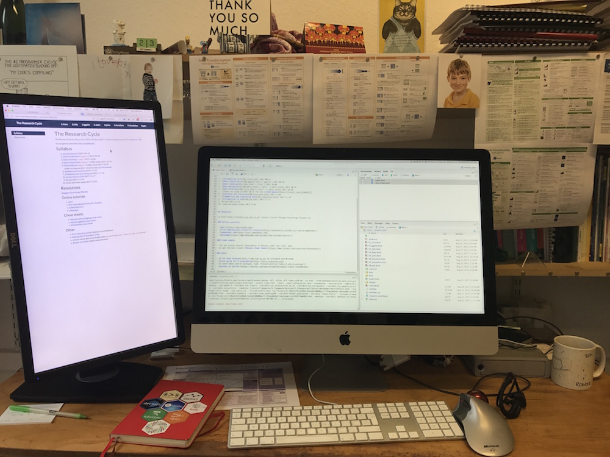

The Research Cycle will run from 2017-09-22 to 2017-11-24 on Fridays from 10-12 in 
[Boyd Orr 520](https://www.google.com/maps/d/viewer?mid=1Zdd1zxeex09Awbz3t1Mm4KEvxKI&hl=en&ll=55.87327%2C-4.292779&z=17).

It is taught by [Dale Barr](http://talklab.psy.gla.ac.uk/) and [Lisa DeBruine](http://facelab.org/debruine).

## Syllabus

1. [Introduction to R](01_intro.html) 2017-09-22
2. [Data visualisation](02_ggplot.html) (`ggplot`) 2017-09-29
3. [Data cleaning](03_tidyr.html) (`tidyr`) 2017-10-06
4. [Data manipulation](04_dplyr.html) (`dplyr` 1-table verbs) 2017-10-13
5. [Data relations](05_joins.html) (`dplyr` 2-table verbs) 2017-10-20  
    (note: no class on 2017-10-27 for the [cSCAN Debate](http://tinyurl.com/cSCAN2017))
6. [Iteration and functions](06_functions.html) 2017-11-03
7. [Probability and simulating data](07_simulation.html) 2017-11-10
8. [Introduction to GLM](08_glm.html) 2017-11-17
9. Review 2017-11-24
10. Exam and meta-issues 2017-12-01

## Resources

<a href="http://rstudio1.psy.gla.ac.uk" target="_blank">Glasgow Psychology RStudio</a>  
[R for Data Science](http://r4ds.had.co.nz) by Grolemund and Wickham

### Online tutorials

- [swirl](http://swirlstats.com)
- [R for Reproducible Scientific Analysis](http://swcarpentry.github.io/r-novice-gapminder/)
- [codeschool.com](http://tryr.codeschool.com)
- [datacamp](https://www.datacamp.com/courses/free-introduction-to-r)

### Cheat sheets

- You can access several cheatsheets in RStudio under the `Help` menu
- Or get the most recent [RStudio Cheat Sheets](https://www.rstudio.com/resources/cheatsheets/) 
    

      
      <i>All coders use cheat sheets and online resources constantly</i>
    

### Other

- [Style guide for R programming](http://style.tidyverse.org)
- type `browseVignettes("name_of_package")` to learn about add-on packages 
- [#rstats on twitter](https://twitter.com/search?q=%2523rstats) highly recommended!
